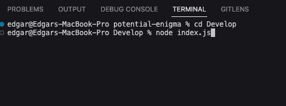
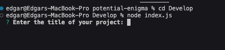
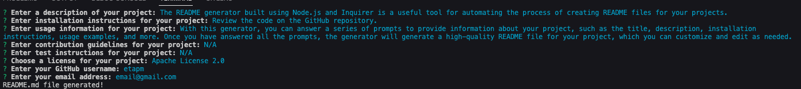
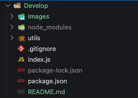
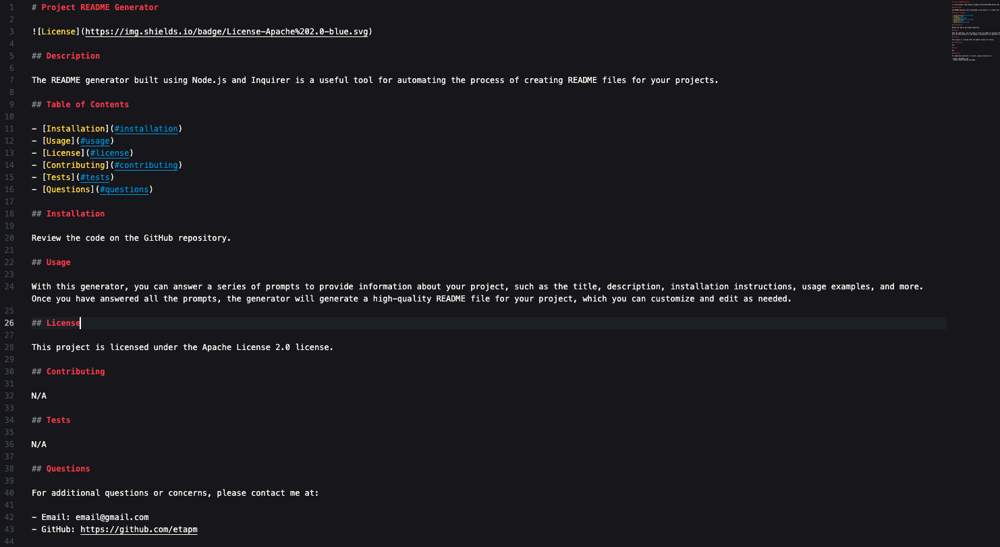
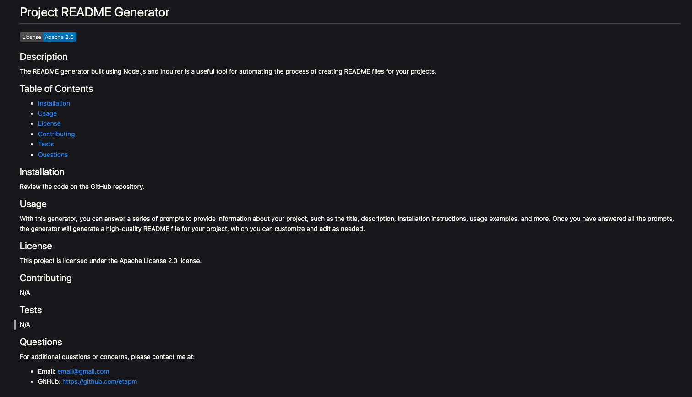

# Professional README Generator

## Description

I made a tool called a README generator using Node.js and Inquirer. This helped me practice coding and create something useful for others. The generator makes it easy to create a clear and informative README file for a project. It asks questions using Inquirer and uses the answers to generate a README. It covers things like what the project does, how to install it, how to use it, and how to contribute. By using Node.js and Inquirer, I learned how to make command-line apps. I also learned how to use Markdown to make the README look nice.

## Table of Contents

- [Installation](#installation)
- [Usage](#usage)
- [Credits](#credits)
- [License](#license)

## Installation

Review the code on the GitHub repository by visiting the [GitHub Repository](https://github.com/etapm/readme-generator).

## Usage

The README generator built using Node.js and Inquirer is a useful tool for automating the process of creating README files for your projects. With this generator, you can answer a series of prompts to provide information about your project, such as the title, description, installation instructions, usage examples, and more. Once you have answered all the prompts, the generator will generate a high-quality README file for your project, which you can customize and edit as needed. This tool can save you time and effort, as you no longer need to create README files manually. Additionally, it can help ensure consistency and professionalism across all your projects.

1. Through your command line, head towards the root directory of your project and run the following command:
   node index.js

2. Answer the prompts to provide information about your project.

3. Once prompts are answered, a README file will be generated for your project.

4. You will see the README file in the root directory of your project.

5. The readme file will contain the information you provided in the prompts.

6. You can customize and edit the README file as needed.

## Credits

N/A

## License

N/A

## Badges

N/A

## Features

N/A

## How to Contribute

N/A

## Tests

N/A
